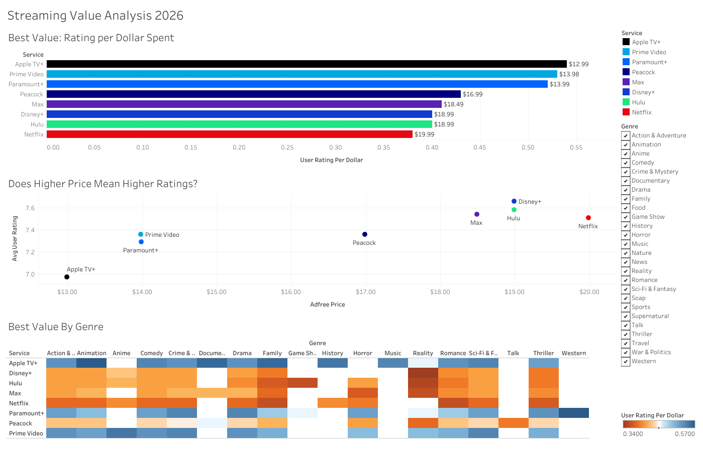

# Streaming Service Value Analysis 2026

What streaming services provide the most bang for your buck?

## The Question

With my layoff in mid-2026, I wanted to make sure I was getting the most for my money, so I looked into some of the leading streaming services to see which ones provide the most quality per dollar spent.

## Key Findings

- Apple TV+ topped the value ratio, but mostly because it is the cheapest option. Its average user rating (6.97) was actually the lowest of the 8 services, so this says more about price than content quality.
- Disney+ had the highest average user rating, but the high ad-free price brought down overall value
- Netflix, Disney+, Hulu, and HBO Max all had around the same average user rating
- Apple TV+ also leads in family content, which is important in my household with 2 young children

## Dashboard

Screenshot of Tableau Dashboard:


<!-- Link the published Tableau Public workbook -->
**[View interactive dashboard →](https://public.tableau.com/views/StreamingServiceAnalysis2026/StreamingValueAnalysis2026?:language=en-US&publish=yes&:sid=&:redirect=auth&:display_count=n&:origin=viz_share_link)**


## Limitations & Future Analysis

- The value ratio (rating ÷ price) is more sensitive to price than to rating, since prices vary far more widely across services than ratings do — this makes it easy for a cheap-but-mediocre service to outrank a pricier one with better content. A weighted or normalized approach (e.g. z-scoring rating and price separately before combining) would better isolate "quality per dollar" from "just cheap."
- Ratings reflect overall catalog averages, not personal viewing habits — a household that mostly watches kids' content might get very different value out of a service than this analysis suggests.
- Watchmode's "popularity" sort may not perfectly represent each service's full catalog, since only the top 250 titles per service were pulled.
- Next step: weight the value score by genres relevant to my household (e.g. Family) rather than an all-genre average, since that's the actual use case driving this analysis.

## Data Sources

- **Watchmode API** — catalog data, user ratings, critic scores, and genres for ~250 titles per service (2,000 titles total across Netflix, Disney+, Hulu, HBO Max, Paramount+, Peacock, Prime Video, and Apple TV+). Pulled July 2026.
- **Pricing data** — manually compiled from Reelgood and Tom's Guide (March 2026), covering both ad-free and ad-supported tiers where available. Pricing data accurate as of July 2026.

## Pipeline
1. **Pull** — `pull_watchmode_data.py` fetches popular titles per service, then makes a second per-title API call to get genres/ratings (Watchmode's list endpoint doesn't include them).
2. **Load** — raw CSVs get loaded into Postgres as-is (`create_tables.sql`), no transformation yet.
3. **Clean** — service names get normalized across the two tables, limited-library plans get filtered out, genres get consolidated and split into their own table, and pricing gets joined onto titles (`cleaning.sql`).
4. **Analyze** — four SQL views compute average ratings and value-per-dollar, both overall and by genre (`analysis.sql`).
5. **Export** — those views get written to CSV (`export_for_tableau.sql`) since Tableau Public can't connect to a live Postgres database.
6. **Visualize** — CSVs get pulled into Tableau to build the dashboard.

## Repo Structure
```
scripts/ # Python script that pulls catalog/rating data from the Watchmode API
sql/ # numbered SQL files: create tables → clean/join → analyze → export for Tableau
data/ # raw pulled data, manual pricing data, and the CSVs exported for Tableau
tableau/ # packaged Tableau workbook (.twbx)
images/ # dashboard screenshot
```

## Reproducing This

1. Get a free Watchmode API key: https://api.watchmode.com/requestApiKey
2. Set it as an environment variable: `export WATCHMODE_API_KEY="your_key_here"`
3. Install dependencies: `pip install -r requirements.txt`
4. Run `scripts/pull_watchmode_data.py` to pull the raw title data
5. Run the SQL files in order against a local Postgres database: `create_tables.sql` → `cleaning.sql` → `analysis.sql` → `export_for_tableau.sql`
6. Open `tableau/Tableau_Packaged_Workbook.twbx` in Tableau (Public or Desktop) to explore the dashboard

## Notable Challenges & Decisions

- Watchmode's list endpoint doesn't return genres or ratings — only a separate per-title `/details/` call does. With ~2,000 unique titles, that's most of a month's free-tier quota in one run, so I added a checkpoint file and retry logic so the script can resume instead of losing progress if it hits the quota or a network error.
- Service names weren't consistent between the catalog data and my pricing data (e.g. "HBO Max" vs. "Max," "Amazon Prime Video" vs. "Prime Video"), so I normalized them in SQL before joining.
- Genres came back pretty granular (Action, Adventure, Sci-Fi, Fantasy, etc. as separate tags), so I consolidated related ones to make the genre breakdown more readable.
- Tableau Public can't connect directly to Postgres, so instead of a live connection I exported the analysis views to CSV and built the dashboard off of those.

## Tech Stack

Python · PostgreSQL · SQL · Tableau Public